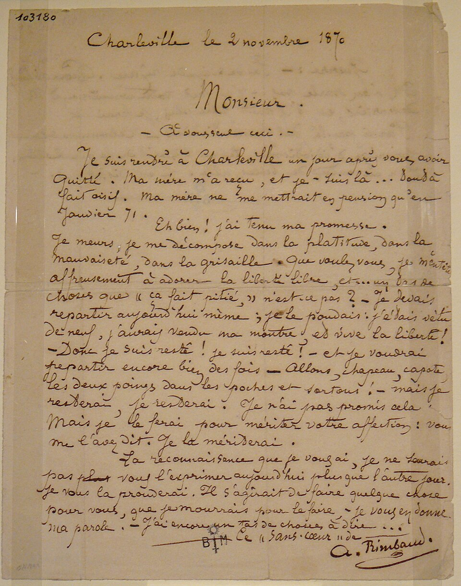
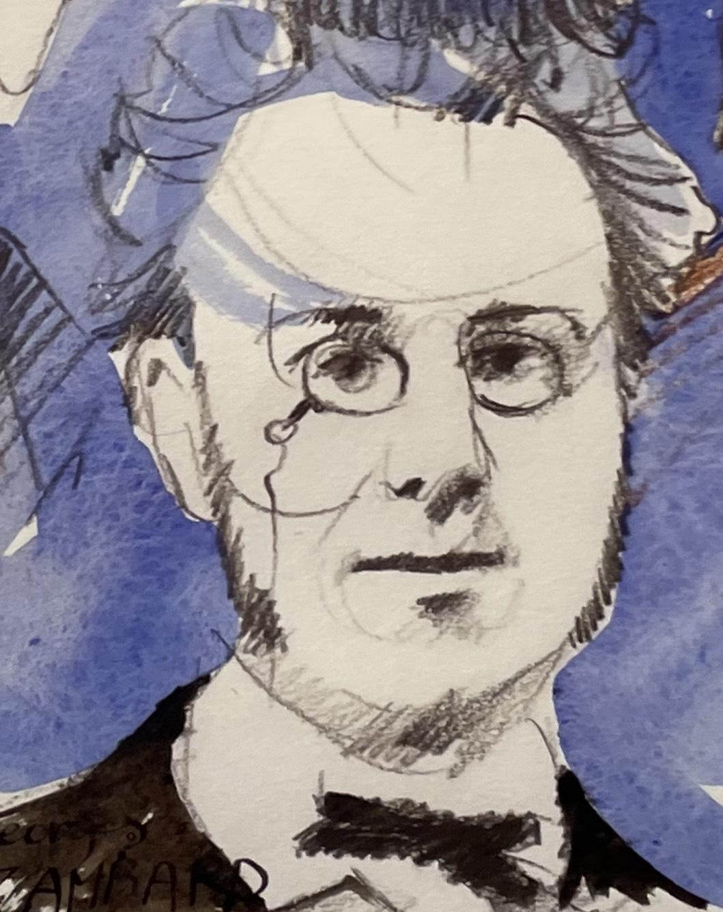

```{r setup, include=FALSE}
knitr::opts_chunk$set(echo = FALSE)
library(tufte)
```

# Introduction


```{r margin-image, echo=FALSE, fig.margin=TRUE, fig.cap="photograph of Georges Izambard", out.width="100%"}
knitr::include_graphics("Georges Izambard part 1.jpg")
```

As part of a series of posts detailing the lives of people close to Rimbaud and Verlaine^[see [this post](https://www.reddit.com/r/RimbaudVerlaine/comments/1m0cerl/portrait_isabelle_rimbaud/) for a profile on Rimbaud's sister Isabelle], I though it would be interesting to do a profile of Georges Izambard, Rimbaud’s high school teacher and early poetic mentor. 

Part 1 covers Izambard’s arrival in Charleville, his influence on Rimbaud’s poetic and emotional development, and how he left his teaching position after the Franco-Prussian war broke out.

Part 2 covers what happened to Rimbaud in the months following Izambard’s departure, the correspondence between them during that time, the bombshell “seer” letter that Rimbaud sent to Izambard, and the end of their friendship.

Part 3 will address how Izambard contributed to Rimbaud’s literary legacy and how he helped to shape the image of Rimbaud that emerged in public consciousness – and how Izambard eventually emerged as probably one of the most grounded, balanced and honest of Rimbaud’s early biographers.  Throughout this post I’ll be quoting from *Rimbaud tel que je lai connu*^["The Rimbaud that I Knew", a 1947 collection of Izambard's writings about Rimbaud], as well as *Delahaye témoin de Rimbaud*^[a 1974 collection of Ernest Delahaye's writings, with commentary by Frédéric Eigeldinger et André Gendre] 

Although most of the factual information contained in this post can be found in the English language biographies of Rimbaud by people like Graham Robb, Edmund White and Charles Nicholl, I find that most of the biographers tend to take the facts from Izambard’s book while neglecting the emotional aspects of Izambard’s perspective.  This is a pity, as Izambard has a sharp, decisive and humorous voice of his own, and he writes about his former student with affection but admirable clear-headedness – despite coming in for a lot of mudslinging from Rimbaud’s family, as we shall see in part 3.


# Part 1

## First Impressions

`r newthought("Georges Izambard first arrived")`
in Charleville in September 1869 and took up a teaching post at the Lycée that Rimbaud attended.  Izambard had been employed to teach the rhetorics class, the penultimate stage of the classical education as it was then structured.  At only 20 years old, Izambard was just a few years older than the majority of his new students, and in fact actually younger than a handful of them.
Izambard was made aware of Rimbaud before he had even taught his first class.  The principal of the school explained to him that Arthur was their star pupil, a safe bet to ensure that the school made a good showing in regional competitions, and that Izambard was under strict instruction to carefully nurture this prize talent.  
Izambard’s first impression of Rimbaud was of an unusually small, unusually quiet fifteen-year-old:

>“The Rimbaud I knew was the “dreamy little Tom Thumb,” small and shy — don’t trust those kinds of shyness —the somewhat stiff rhetoric student, well-behaved and mild-mannered, with clean fingernails, spotless notebooks, astonishingly correct homework, school grades that were ideal, in short, one of those exemplary and immaculate little monsters, embodying to the extreme the type of the prize animal, the “well-behaved” boy of the lycée”

However, as Izambard got to know him better, another Rimbaud began to gradually reveal himself.  Once he learned that his new teacher was passionately interested in poetry and was an aspiring poet himself, the quiet student started to open up to him.  Rimbaud even started to linger in the classroom at the end of the school day, so that he and Izambard could discuss poetry together on the walk home.  A friendship developed between them in which Rimbaud felt safe to speak his mind, and Izambard recalls that debates between them could become quite heated, as they both felt able to express their opinions forcefully.  For Rimbaud, this was priceless.  He was not only naturally shy, but he had also been brought up in a stultifying home where he was not at all free to say what he wished.  For what was probably the first time in his life, Rimbaud was able to engage in conversations with an adult on equal intellectual footing, without fear that he would be punished either for his ideas or the way in which he expressed them.

Izambard in turn reports that he gradually became aware of just how repressive Rimbaud’s home life was, and that he felt considerable sympathy for him because of it.  He started to lend his pupil books and reading material that his mother would forbid – not because these books were anything that we would now consider inappropriate for a teenager, but because they often expressed views that challenged the establishment or the conventional views of the day.  He recalls one particular occasion when he was called into the principal’s office because Rimbaud’s mother had written an angry letter complaining about a book he had lent her son – *Notre Dame de Paris*, by Victor Hugo.  Mme Rimbaud was probably angry about this, not because of any specific content in the book, but because she was suspicious of Victor Hugo’s reputation.  Due to his frank depiction of social ills and vocal criticism of both the French government and the corruption within the Catholic church, many of Hugo’s works had actually been placed on the *Index Librorum Prohibitorum*, or the list of forbidden books.  As a devout Catholic, Mme Rimbaud feared that her son was being led astray.

## Poetic mentorship

`r newthought("Izambard was not only a teacher")` and mentor, but an early audience for Rimbaud’s poems.  Rimbaud started to hand in poems along with his homework, eager for Izambard’s opinion.  Izambard gives an illustrative account of a discussion they had about Rimbaud’s poem À la musique:

>"I was traditional… but fair, and since, in this context, I was no longer in the classroom, I didn’t correct, I offered suggestions. ‘I’m not your teacher here,’ I would tell him. — ‘Fair enough,’ he’d reply, ‘but tell me anyway…’ I didn’t expect him to accept all of my critiques — is that the way of poets? He listened, but he argued back strongly.

>There is, however, one line in the poem À la musique that I dare to claim credit for. His original version:

>*Et mes désirs brutaux s’accrochent à leurs lèvres…
(‘And my brutal desires cling to their lips…’)*

>…sounded too much like the blustering excess of some dumb, puffed-up heartbreaker; it clashed with his modest, timid schoolboy demeanor. He liked my reasoning. By chance, in an earlier poem of mine, I had a ready-made line with the same rhyme. I offered it to him the way you might offer someone a cigarette; he liked it and accepted it:
*‘Et je sens des baisers qui me viennent aux lèvres.’
(‘And I feel kisses rising to my lips.’)"*

Izambard could already perceive that Rimbaud was a prodigious talent – one not in need of instruction but in need of an audience.  He said that he started to see a “new Rimbaud” emerging month by month, such was the startling rate at which Rimbaud seemed to be able to imitate, absorb and assimilate different poetical styles.  

Then, at the end of the school year in August 1870, Izambard left Charleville for the summer holidays.  He may not have known it at the time, but due to the coming disruptions of the Franco-Prussian war he would never again return there to teach.  It is due to the fact that Izambard left Charleville in 1870 that some of Rimbaud’s earliest known letters are addressed to him – and it is also through one of these early letters that we know precisely when Rimbaud first read and engaged with Verlaine’s poetry.  In this letter from August the 29th of 1870 we see Rimbaud express a strong appreciation for Verlaine’s early collection Fetes Galantes – and specifically his poem Dans la grotte.  An excerpt of his letter is below:

>"I have Paul Verlaine’s Fêtes galantes, in a charming little pocket edition. Really strange, very funny; but, really, adorable. Sometimes there are bold liberties taken; for example:

>*“And the terri|ble tigress of Hyrcania”*

>is a line from that book.

>Buy it, I recommend it — La Bonne Chanson, a little book of poems by the same poet; it’s just been published by Lemerre; I haven’t read it — nothing gets here — but several papers speak very highly of it.

>Goodbye — send me a 25-page letter — general delivery, and quickly!

>A. RIMBAUD

>P.S. — Soon, revelations about the life I’m going to lead after the holidays...”


This is a translation of the letter, but there is something very significant in the original Frech text which doesn’t really come through in the English^[please read [this post](https://www.reddit.com/r/RimbaudVerlaine/comments/1m1hlf2/verlaine_dans_la_grotte_1869/) for a thorough explanation of what the “terrible tigress” might actually mean.]


It is striking that Rimbaud homed in on and underscored Verlaine’s hidden, homoerotic pun, and was eager to test Izambard with it, to see if he was able to pick up on its underlying meaning too.  While Izambard undoubtedly did pick up on the line’s metric oddity, it’s unclear if he ever fully grasped what Rimbaud was pointing out to him – as we shall see later in part 3 of this series.  It’s also unclear if Izambard picked up on the meaning of Rimbaud’s cryptic post-script, or its ominously trailing ellipses...

## Rimbaud in jail and his first stay at Douai

`r newthought("The very next week,")` on the 5th of September 1870, Izambard received another letter from Rimbaud – this time from jail.  Rimbaud wrote to tell him that he had run away from home to Paris but had been arrested when he was unable to pay the full train fare and was now stuck in Mazas jail.

>"Cher Monsieur,

>What you told me I shouldn’t do, I did: I went to Paris, abandoning my maternal home! I left August 29. Stopping when getting off the train because I was penniless and owed the railroad thirteen francs, I was taken to the prefecture, and today I am awaiting my verdict in Mazas! Oh! —I depend on you as though on my mother; you have never been less than a brother to me: so I ask for the immediate help you’ve offered before. I wrote my mother, the imperial prosecutor, the Charleville chief of police; if you don’t hear anything from me on Wednesday, before the train for Paris leaves from Douai take that train, come here and claim me by letter or go to the prosecutor yourself, beg, vouch for me, pay my debt! Do everything you can, and, when you get this letter, write, you too, I order you, yes, write to my poor mother (quai de la Madeleine, 5, Charlev.) to console her, write me too, do it all! I love you like a brother, I will love you like a father.

>Taking your hand, your poor

>Arthur Rimbaud"


Izambard agreed to pay the outstanding debt for Rimbaud’s train ticket and brought him back to the house he was staying at in Douai, the home of his two aunts, the Gindre sisters.  Rimbaud stayed here for a few weeks.  Later, Izambard would contend that *Les Chercheuses de poux*^["The Lice Seekers"] was inspired by Rimbaud’s experience of being cared for by the gentle Gindre sisters during this time, who helped to comb through his hair and get rid of the lice he had picked up in jail. 

Due to postal disruptions caused by the Franco-Prussian war, Rimbaud ended up staying in Douai for a few weeks, diligently writing out poems and demanding paper from the Gindre sisters.  When the sisters suggested that perhaps he could save paper by writing on both sides of the sheet he responded with shocked indignation that a writer should never write on both sides if the poem is intended for publication.  Izambard includes this anecdote to illustrate that Rimbaud was already committed to the idea of becoming a published author.  In fact, during this stay in Douai Izambard was able to introduce Rimbaud to Paul Demeny, his friend, the published author of le Glaneuses and also part-owner of his own publishing house.  Rimbaud sent Demeny a total of fifteen poems in all.  Luckily for posterity’s sake Demeny took good care of these manuscripts -  it is Demeny’s “dossier” which comprises a large part of Rimbaud’s surviving early poems.

Writing poetry is not all that Rimbaud got up to during his second stay at Douai.  In reaction to the threat of the advancing Prussian army, Izambard went to the local offices of the National Guard to sign up for the war effort.  Rimbaud went with him:

>“When I went to sign up, Rimbaud offered to accompany me on this little patriotic stroll. On the way, he suddenly declared, flat-out: “I’m going to enlist at the same time as you.” I tried to explain that, since he was not yet of age, he couldn’t enlist without his mother’s permission —but he refused to believe such an “absurdity,” and when the recruiting officer gave him a firm and final “no,” he walked out, fuming about “bureaucratic cowardice.”

Although Rimbaud was not allowed to officially enlist, he was permitted to join in with the practice drills – although the insufficient local funds meant that the drills took place using broomsticks in place of rifles.

Rimbaud also left behind at least one more poem in Douai, in addition to those he gave to Demeny.  Izambard recalls finding this “memento,” left by Rimbaud in an unusual location:

>"After his departure, the next day or a few days later, someone in the household noticed a short poem, in his handwriting, on the front door of the house.  It didn’t take up much space and wasn’t very visible, written in pencil on the dark green of the door. Someone pointed it out to me, and I ran to read it. I should have taken a pencil and copied it down on the spot — it was so simple.  Too simple: each of us thought of it, and no one did it. The house wasn’t on fire, after all — come on!... No, but the following week, painters came early one morning to give the door a fresh coat of paint. By the time we realized the danger, the damage was done."

After a few weeks of dealing with delays and disruption caused by the Franco-Prussian war, Izambard was finally able to arrange Rimbaud’s return to Charleville.  Fearing that he would simply run off again if he didn’t accompany him on the journey home, Izambard chose to come with him to deliver him to his mother’s care.  Izambard reports that Rimbaud was subdued on the journey home:

>"Along the way, I told them about an invitation I had received that very morning from one of my old school friends, Paul Durand, now living in Brussels with his mother. He had invited me to spend a bit of vacation time with him. I wouldn’t have much time to spare, but I would still stop by to see him on my way back from Charleville...  Rimbaud had withdrawn to a corner of the train car, didn’t say a word — his mind was elsewhere. Was he still writing verses, or thinking about the welcome that awaited him?"

It is possible that Rimbaud was composing verses in his head during this journey, as his poem *Rêvé pour l’hiver* is dated a few days later and specified that it was written on a train^[this poem, "Dream for Winter" is post scripted with the words *“En wagon, le 7 octobre 1870.”*]. The welcome that awaited Rimbaud was also indeed furious – with Mme Rimbaud slapping Arthur around the head, and, as Izambard reported to the journalist Rudolphe Darzens later, shouting at him as though he had *“abducted her son and she knew already about Rimbaud’s inclinations.”*^[Graham Robb, 2000 – his translation of Darzen’s interview notes]

## Rimbaud's return to Douai

`r newthought("Mme Rimbaud had cause to swallow her anger")` and appeal to Izambard only a few days later – after only a couple of days back at his “maternal” home, Rimbaud had run away once again, and she wanted his help to find him.  Izambard - who was by this point probably getting pretty tired of this dysfunctional family and its demands on his time - agreed to help search for him and checked in at the homes of a few of Rimbaud’s school friends, but with no luck.  After giving up the search, Izambard resumed his original vacation plans, and went to visit his friend Paul Durand.  Durand and his mother gave him a warm welcome – and mentioned that his friend “little Rimbaud” had been by to see him, but, finding Izambard not there, had continued on to the Gindre’s house in Douai to wait for him.  I seems that Rimbaud had been listening to Izambard’s conversation on the train, and had remembered his remark about his plans to visit Durand, and had deliberately timed his journey through the French and Belgian countryside to terminate in a rendezvous with Izambard at Durand’s house.
Izambard hurried back to Douai to find Rimbaud being looked after by his aunts, apparently calm and writing out several new poems: *Au Cabaret vert, La Maline, Le Buffet, Ma Bohème.*  All of which, as Izambard said, *“had the nerve to be charming”. *

## That "heartless" Rimbaud

`r newthought("Rimbaud stayed for a little while longer,")` before a letter from his mother arrived, demanding that Izambard arrange for Rimbaud to be escorted home – this time by the police.  Izambard reports taking a very downcast Rimbaud to the police station:

>“Rimbaud is ready and waiting for me, his little bundle under his arm. He’s said a kind goodbye to my aunts, who made him promise “to behave himself”... He promised.  Along the way, I speak to him from the heart — about my concern for his future, for his glory, and for his dignity too... I have the impression that he understands me, that he’s inwardly moved, that his heart is tight... Maybe I’m wrong! He is so impenetrable... We arrive: I present him to the commissioner; the latter promised me that he wouldn’t be treated harshly. We shake hands firmly, and... farewell, then!... It was the last time I ever saw him.  But a letter from him soon arrived for me:"


```{r sans-coeur, echo=FALSE, fig.margin=TRUE, fig.cap="original manuscript of the 2nd Nov. 1870 letter", out.width="100%"}

```


>>Charleville, November 2, 1870

>>Monsieur — For your eyes only —

>>I got back to Charleville a day after I left you. My mother welcomed me, and I’m here now... completely idle. My mother won’t be sending me to boarding school until January of ’71.

>>Well! I’ve kept my promise. I’m dying, decomposing in mediocrity, in meanness, in greyness. What do you expect — I stubbornly persist in loving free freedom, and... a whole bunch of things that are “so very unfortunate,” aren’t they?

>>— I should have left again today; I could have — I was wearing new clothes, I could have sold my watch, and hurrah for freedom!

>>— So I stayed! I stayed! — And I’ll want to leave again, many more times. Come on, hat, greatcoat, fists in pockets, and out the door! — But I’ll stay, I’ll stay. I didn’t promise that. But I’ll do it to earn your affection: you told me so. I will deserve it.

>>The gratitude I have for you — I wouldn’t know how to express it today any more than I did the other day. I’ll prove it to you. If it meant doing something for you that would kill me to do — I give you my word, I would do it.

>>— I still have so many things to say...

>>This “heartless”

>>A. RIMBAUD^[On the back of the letter:
"War; no siege of Mézières. For when? Nobody knows. — I delivered your message to M. Deverrière, and if more needs to be done, I’ll do it. — Here and there, some franc-tireur activity. Abominable outbreak of idiocy — that’s the spirit of the population. You hear some real beauties, let me tell you! It’s all dissolving.”]


Reflecting on this letter years later, Izambard had this to say:

>"If anyone wants to judge me as overly... sentimental, I admit that my eyes welled up when I recently found and reread this letter. And I publish it all the more gladly because it seems to me that it does as much honour to Rimbaud as to myself."

And if the story had all ended there, it would have just been a slightly sad, but ultimately heart-warming account of how an enthusiastic teacher helped a troubled but brilliant teenager to develop his full potential.  But of course, it didn’t end there.


# Part 2 

```{r izambard_drawing, echo=FALSE, fig.margin=TRUE, fig.cap="A picture of Izambard displayed in the Rimbaud museum at Charleville", out.width="100%"}

```

## The Siege of Mézières

By November of 1870, Rimbaud had just returned home to his mother in Charleville again – this time under a police escort.  A few days after his homecoming, Izambard received an unusually emotional letter from his “heartless” student, promising not to run away again.

In his letter, Rimbaud also mentioned that his mother was threatening to send him away to boarding school, a prospect he did not seem to be looking forward to with any enthusiasm.  However, fortunately for Rimbaud, something happened to save him from boarding school.  The Franco-Prussian war, which had broken out earlier in the year, finally arrived on his doorstep.  After the battle of Sedan in September 1870, the Prussian army advanced further towards Charleville, and on November the 17th, just two weeks after Rimbaud sent the “heartless” letter, Mézières, the next town over from Charleville, and the home of Rimbaud’s best friend Delahaye, was under siege.  German artillery blasted explosives into the small town.  Delahaye reports watching shells fall on the church belltower, his neighbours’ houses, and even the local boarding school – if this was the school that Mme Rimbaud had planned to send Arthur to, this may explain why he never went there in the end!

Delahaye recounts how a local newspaper reported eighty to a hundred people dead in Mézières – including him and his family.  Upon hearing the news, Rimbaud apparently

>“began to think about me and, in the hollow of his right hand, weighed, with a touch of melancholy irony, the little pile of ashes his friend might now have become.”^[ Delahaye témoin de Rimbaud]

He set off towards his friend’s house to find his remains, but when he got there found that the house, although mostly destroyed, contained no corpses.  Delahaye and his family had, luckily, evacuated the house before it was shelled, and had in fact taken refuge with some neighbours.  When Rimbaud was finally able to track his friend down, his first question was – what had happened to their pipes?!  Both Delahaye and Rimbaud’s mothers naturally disapproved of them smoking, so Delahaye had taken to stashing their pipes in an alcove in the chimney of his house.  Unfortunately, the pipes had fallen victim to the shelling.

There was one other casualty of the shelling that might have been significant to Rimbaud – the offices of a small local newspaper, where Rimbaud had been hoping to take up a position as a journalist.  Once again, his literary ambitions had been, quite literally, exploded.

The siege of Mézières lasted until the 2nd of January 1871, when the French army was defeated and the Prussians took the town.  Despite this gloomy outcome, Delahaye and Rimbaud managed to have a good time together.  The Prussian soldiers billeted there were not exactly hostile to the surrendered townspeople, and since ordinary routines were disrupted and school had not yet resumed, the two boys had plenty of time to spend their days exploring the rubble of the blown-out buildings, reading, talking, and enjoying the outdoors. 

## Delahaye returns to school

Meanwhile, Izambard had been rather closer to the war than even Rimbaud and Delahaye.  If you remember in Part 1, in August of 1870 Izambard had enlisted with the National Guard.  Rimbaud had wanted to sign up along with him but had been rejected due to being underage.  While Mézières was being bombarded, Izambard had been involved in combat, and, according to Delahaye, had either been injured or had suffered an ear infection that led to permanent hearing loss: 

>“Izambard, too, had enlisted; I could have added that, serving in the Army of the North, he suffered terribly during the harsh winter of 1870–71 and contracted the beginnings of an incurable infirmity (loss of hearing), for this poet, this journalist, this critic so gifted at sensing beauty, is also a “wounded veteran” of the last war.”^[Delahaye témoin de Rimbaud]

Izambard was not left totally deaf, but his hearing was apparently impaired enough to make the prospect of returning to teach at Charleville a non-starter.  When school finally resumed in Charleville, Delahaye returned, but Rimbaud refused.  By this point, Rimbaud seemed to be in a state of total rebellion against all the expectations his mother and society held him to.  He grew his hair long^[see [this post]( https://www.reddit.com/r/ArthurRimbaud/comments/1ls6i1d/rimbauds_hair_timeline_more_drama_than_youd_expect/) for more on this], started smoking a pipe, and, while Delahaye was studying in school, Rimbaud spent time loitering outside of it.

Although Rimbaud was disillusioned with formal education at this point, Delahaye found Izambard’s successors at the Charleville school, a teacher called Édouard Chanal, to be a great guy, and suggests that his praise for Chanal may have led Rimbaud to tentatively try to befriend him, although he was ultimately too shy:

>“The young professor’s literary tastes were just what he liked. Add to this Rimbaud’s obsessive need for intellectual communion, and you’ll understand why one afternoon, while wandering alone through the paths of the Petit-Bois, he made his way over to Édouard Chanal, who was sitting on a bench, peacefully smoking his pipe.  What exactly did he want to say to him?… I don’t know… We’ll never know. This episode will remain shrouded in the darkness of the immense chaos of ideas and contradictory impulses that governed Rimbaud’s destiny. He obviously wanted to talk, to exchange thoughts, to share some verses, to get an opinion, perhaps even ask for one—just as later he would submit his poems to Verlaine’s judgment…I believe that, unconsciously, Rimbaud wanted Chanal to replace the absent Izambard. There are many similarities between them—most of all: simplicity, modesty, and courage without any affectation.“

Delahaye’s account is touching, if a bit proto-Freudian in his speculation about Rimbaud’s unconscious motives.

## The Evolution of Rimbaud’s poetry

Meanwhile, Rimbaud was continuing to write poetry and was continuing to send these to Izambard. These new poems were nothing like the “charming” poems he had written at Izambard’s house in Douai the previous autumn.  These poems were darker, more savage tone – they were revolutionary (‘Chant de guerre parisien’), sadistic (‘Mes Petites amoureuses’), scatological (‘Accroupissements’), and sacrilegious (‘Les Premières communions’)^[this may have been inspired by his younger sister Isabelle’s first communion, which occurred on the 14th of May 1871.]

Izambard seems to have been somewhat bemused by this shift in tone:

>“he had recently sent me "A Tearful Hydrolat," an untitled piece that later became Mes petites Amoureuses. I didn’t hide from him that I found it unpleasant. “Is that all you’ve taken from reading Rabelais?” I asked.”

But from a modern perspective, this change in Rimbaud’s mood is perhaps not surprising: In the six or so months since school last broke up for the summer holidays, he had seen a war break out, he had been thrown in jail, he had briefly believed that his best friend was dead, and all his attempts to get recognition for his immense talent had come to nothing.  Rimbaud’s sense of impatience at having his potential repeatedly thwarted must have been unbearable.  And, to add insult to injury, Izambard, who used to be his confidant, seemed unable to understand the direction his poetry was moving towards.  Izambard’s responses of distaste may have made it feel like he was outgrowing his mentor.

## The Paris Commune and it’s impact on Rimbaud

Something else which was very significant to Rimbaud’s life and writing occurred around this time; the rapid rise and then violent suppression of the Paris Commune.  The Franco-Prussian War had led to the collapse of the Second Empire, and the establishment of the Third Republic. For many, including Rimbaud, this seemed like a possible turning point: a move away from the authoritarian controls of the imperial regime.
However, the Republic quickly faced crisis. The Prussian army laid siege to Paris for four months, leaving the capital’s population starving and angry. In January 1871, shortly after the surrender of Mézières, the Republican government agreed to an armistice. As part of the peace settlement, France ceded Alsace and Lorraine. A new government led by Adolphe Thiers was elected soon after, but it was seen by many as aligned with Royalist factions and suspected of favouring a return to the pre-Republican regime.

Tensions reached a breaking point on 18 March, when troops from the regular army attempted to seize the cannons of the National Guard, which were stationed in working-class neighbourhoods of Paris. The attempt failed, and the soldiers withdrew. In response, a group of National Guards and Parisian citizens took control of the city and proclaimed a new form of government: the Paris Commune.

The Commune lasted for a little over two months. It established itself as a locally elected authority for the capital and attempted to carry out a number of immediate social and civil reforms, including the suspension of rent arrears^[during the Siege of Paris, productive work had ground to a halt.  However, despite the workers being unable to generate income, the rentiers and landlords refused to suspend rent], the separation of church and state, the reopening of abandoned workshops under workers’ control, and measures aimed at increasing the legal and political participation of women. 

Meanwhile, Thiers and his ministers had regrouped in Versailles, where they planned a return assault on the capital. On 21 May, government troops breached the Parisian defences. What followed became known as the Semaine sanglante^[“The Bloody Week”], and the Commune was violently crushed. The aftermath was severe: thousands were executed, and tens of thousands imprisoned or deported.

While it is not clear to what extent Rimbaud was directly involved in the Commune.  We do know that several of his friends claim that he was present in Paris during the Commune^[ https://www.reddit.com/r/RimbaudVerlaine/comments/1m5ncqm/the_runaway_poet/]  However, we do know for sure that Rimbaud was back in Charleville right before bloody week, and we also know that he was electrified by the ideals of the Commune, and the possibilities that it represented to him.  And we know both of these things precisely because of a very important letter that he sent to Izambard, immediately before bloody week.

## Background on the letter of the seer

On the 13th of May 1871, Rimbaud wrote a letter to Izambard which was to become one of the most famous literary letters of all time – his first Lettre du Voyant, or “letter of the seer”. A great deal has been written about the letters of the seer, and since there is so much pre-existing debate on the subject, I won’t go too far into it here.  Instead, I will focus on Izambard’s own take on what this letter might have meant, and the impact it had on their friendship. 

It is important to note that, when he first started writing about his memories of his friendship with Rimbaud, this letter had been lost among Izambard’s boxes of notes.  Rimbaud was no longer alive, and Izambard’s memories of how their friendship eventually petered out were hazy.  All Izambard could remember was the last poem he ever received from Rimbaud was *Le Cœur supplicié.*  Searching for a reason why their friendship had ended, Izambard speculated that perhaps it had been something to do with how he had responded to the poem – perhaps he had failed to appreciate it, or maybe Rimbaud had been hurt by the poem that Izambard sent in response, a humorous but deliberately ridiculous parody.  All Izambard knew for sure was that, after this, their correspondence tapered off and never resumed.

However, Paterne Berrichon, one of Rimbaud’s early biographers, and who happened to be married to Rimbaud’s younger sister Isabelle, seized on this tentative explanation and ran with it.  There will be more on Berrichon and his feud with Izambard in part 3, but for now it is sufficient to say that Berrichon was Izambard’s enemy – he made many untrue claims about Izambard’s friendship with Rimbaud, but one of the lies that angered Izambard the most was Berrichon’s wild exaggerations about how Izambard had responded to *Le Cœur supplicié.*  Izambard explains as follows:

>Last year, M. Berrichon hazarded, in veiled language, the “unpublished” hypothesis of a “violent break” between Rimbaud and me. What would it matter to the public if it were true? I answer simply, for the sake of the record, that there was never at any point either violence or premeditated rupture. But M. Know-It-All insists on his legend, and to bolster it, he pretends to know that in May 1871 I received from Rimbaud, in response to some friendly criticisms of mine, a letter “giving the censor leave of his soul”—a letter supposedly “infinitely crude, raving, and full of hyperbolic insults.”  (Has he seen this letter? Has he read those insults?)
Whereupon, I supposedly took offense in turn. At this point—projecting onto me the venom he has just attributed to Rimbaud—the slanderer allows himself to write:

>>“M. Izambard… sent the diatribe back to the madman’s mother with remarks…” (Has M. Berrichon read them?) “…with remarks at the very least suggesting coercive measures.”

>Heavens!  He ends by condemning—just as I myself would condemn—the cowardice of such “denunciation.” As you can see, the recipe has all the spices.

>To this tall tale I offer my honest man’s denial.
